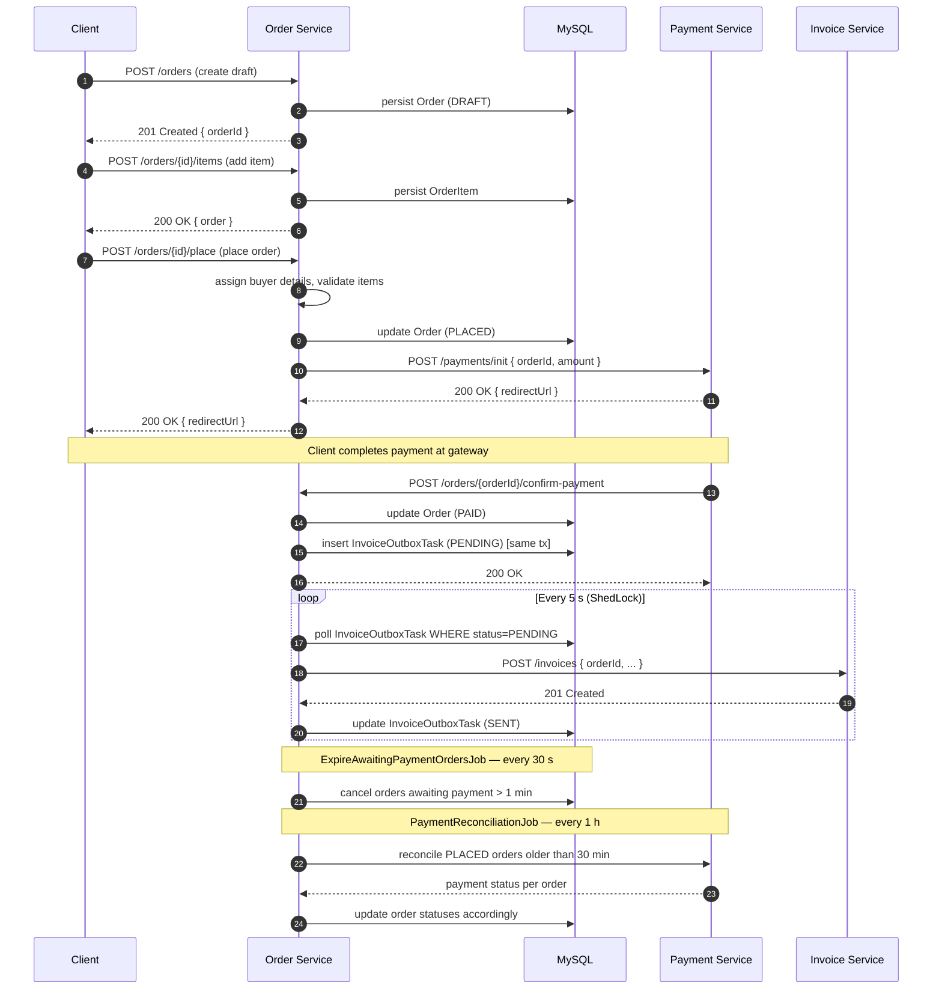
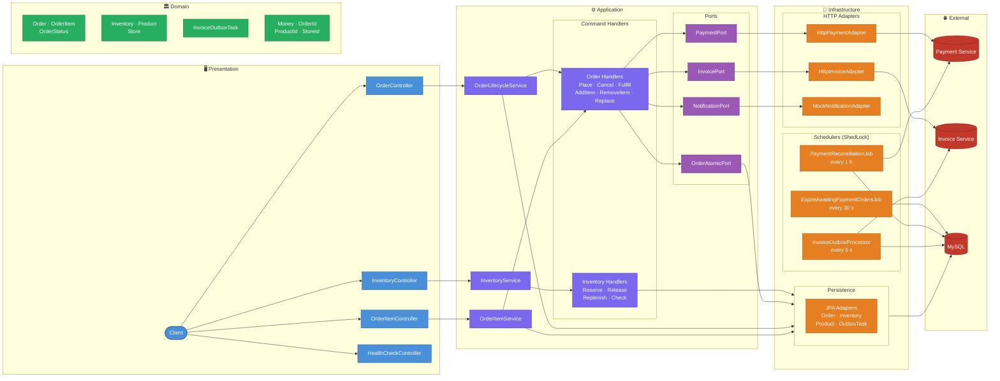

# 🛒 Order Service - Hexagonal Order Management Platform

[](https://spring.io/projects/spring-boot)
 [](https://openjdk.org/)
 [](https://github.com/lukas-krecan/ShedLock)
 [](https://www.docker.com/)
[](https://codecov.io/gh/mrzodeczko-dev/order-service)
[](https://opensource.org/licenses/MIT)

<a id="overview"></a>
## 📖 Overview
[Back to Table of Contents](#toc)

Order Service is a production-ready backend managing the full order lifecycle — from draft creation through payment and fulfillment — integrated with Payment Service and Invoice Service via HTTP adapters, using Domain-Driven Design (DDD), Hexagonal Architecture, CQRS-style command handlers, Invoice Outbox Pattern, and ShedLock-guarded schedulers.

<a id="toc"></a>
## 📚 Table of Contents
- [📖 Overview](#overview)
- [🔄 How It Works](#how-it-works)
- [🌐 API Endpoints](#api-endpoints)
- [🚀 Getting Started](#getting-started)
- [⚙️ Environment Variables](#environment-variables)
- [🛠️ Common Issues](#common-issues)
- [🏗️ Architecture](#architecture)
- [💻 Tech Stack](#tech-stack)
- [🧪 Testing Strategy](#testing-strategy)
- [🛡️ Continuous Integration](#continuous-integration)
- [📊 Observability](#observability)
- [📂 Repository Structure](#repository-structure)
- [🤝 Contact](#contact)

---

<a id="how-it-works"></a>
## 🔄 How It Works
[Back to Table of Contents](#toc)

1. Client creates a draft order via `POST /orders`
2. Client adds one or more items via `POST /orders/{id}/items`
3. Client places the order via `POST /orders/{id}/place` — buyer details are assigned and items are validated
4. Order Service initialises payment by calling Payment Service → `POST /payments/init` → receives a `redirectUrl`
5. Order Service returns `redirectUrl` to the client; client is redirected to the payment gateway
6. After the user pays, Payment Service calls back → `POST /orders/{orderId}/confirm-payment`
7. Order Service updates the order status to **PAID**
8. Order Service triggers invoice creation → `POST /invoices` on Invoice Service
9. An `InvoiceOutboxTask` record is persisted in the same DB transaction (Outbox Pattern)
10. `InvoiceOutboxProcessor` polls the DB every 5 s, forwards pending tasks to Invoice Service, and marks them **SENT** (or increments `retry_count` on failure)
11. `ExpireAwaitingPaymentOrdersJob` runs every 30 s and cancels orders that have been awaiting payment for longer than 1 minute
12. `PaymentReconciliationJob` runs every hour and reconciles stale **PLACED** orders (older than 30 minutes) against Payment Service



---

<a id="api-endpoints"></a>
## 🌐 API Endpoints
[Back to Table of Contents](#toc)

**Base URL:** `http://localhost:8083`

### Order Endpoints

| Method | Path | Purpose | Request Body | Success | Common Errors |
|--------|------|---------|--------------|---------|---------------|
| `POST` | `/orders` | Create a draft order | `CreateDraftOrderRequest` | `201 Created` | `400` |
| `POST` | `/orders/{id}/place` | Place a draft order | `PlaceOrderRequest` (buyer details) | `200 OK` | `400`, `404`, `409` |
| `POST` | `/orders/{id}/cancel` | Cancel an order | — | `200 OK` | `404`, `409` |
| `POST` | `/orders/{id}/fulfill` | Fulfill a paid order | — | `200 OK` | `404`, `409` |
| `POST` | `/orders/{orderId}/confirm-payment` | Confirm payment (callback from Payment Service) | `ConfirmPaymentRequest` | `200 OK` | `404`, `409` |
| `GET` | `/orders/{id}` | Get order by ID | — | `200 OK` | `404` |
| `GET` | `/orders` | List all orders | — | `200 OK` | — |

### Order Item Endpoints

| Method | Path | Purpose | Request Body | Success | Common Errors |
|--------|------|---------|--------------|---------|---------------|
| `POST` | `/orders/{id}/items` | Add item to order | `AddItemToOrderRequest` | `200 OK` | `400`, `404`, `409` |
| `DELETE` | `/orders/{id}/items/{itemId}` | Remove item from order | — | `200 OK` | `404`, `409` |
| `PUT` | `/orders/{id}/items/{itemId}` | Replace product in order | `ReplaceProductInOrderRequest` | `200 OK` | `400`, `404`, `409` |

### Inventory Endpoints

| Method | Path | Purpose | Request Body | Success | Common Errors |
|--------|------|---------|--------------|---------|---------------|
| `POST` | `/inventory/reserve` | Reserve stock | `ReserveStockCommand` | `200 OK` | `400`, `404`, `409` |
| `POST` | `/inventory/release` | Release reserved stock | `ReleaseStockCommand` | `200 OK` | `400`, `404`, `409` |
| `POST` | `/inventory/replenish` | Replenish stock | `ReplenishStockCommand` | `200 OK` | `400`, `404` |
| `POST` | `/inventory/check` | Check stock availability | `CheckStockAvailabilityCommand` | `200 OK` | `400`, `404` |

### Health Endpoint

| Method | Path | Purpose | Success |
|--------|------|---------|---------| 
| `GET` | `/health` | Application health check | `200 OK` |
| `GET` | `/actuator/health` | Actuator health (full) | `200 OK` |
| `GET` | `/actuator/health/liveness` | Liveness probe (Docker) | `200 OK` |

### cURL Example

```bash
curl -X POST http://localhost:8083/orders \
  -H "Content-Type: application/json" \
  -d '{"storeId": "a1b2c3d4-e5f6-7890-abcd-ef1234567890"}'
```

---

<a id="getting-started"></a>
## 🚀 Getting Started
[Back to Table of Contents](#toc)

### Prerequisites

- Docker and Docker Compose v2+
- Java 25+ and Maven 3.9+ (for local builds only)
- Running instances of **payment-service** and **invoice-service**

### Environment Configuration

Create a `.env` file in the project root:

```dotenv
# ─── MySQL ───────────────────────────────────────────────────────────────────
ORDER_SERVICE_MYSQL_DB_ROOT_PASSWORD=changeme_root
ORDER_SERVICE_MYSQL_DB_NAME=order_db
ORDER_SERVICE_MYSQL_DB_USER=order_user
ORDER_SERVICE_MYSQL_DB_PASSWORD=changeme_user
ORDER_SERVICE_MYSQL_DB_PORT=3307
ORDER_SERVICE_MYSQL_DB_HOST=order-mysql
ORDER_SERVICE_MYSQL_INNODB_BUFFER_POOL_SIZE=256M
ORDER_SERVICE_MYSQL_MAX_CONNECTIONS=200

# ─── Application ─────────────────────────────────────────────────────────────
ORDER_SERVICE_PORT=8083
ORDER_SERVICE_APPLICATION_NAME=order-service

# ─── Integrations ────────────────────────────────────────────────────────────
INTEGRATION_PAYMENT_SERVICE_URL=http://payment-service:8082
INTEGRATION_INVOICE_SERVICE_URL=http://invoice-service:8084
```

> When running inside Docker Compose on the same `mr-network`, use container service names as hostnames. For local development use `http://localhost:<port>`.

### Start the Service

```bash
docker-compose up -d --build
```

Verify: `curl http://localhost:8083/actuator/health` → `{"status":"UP"}`

---

<a id="environment-variables"></a>
## ⚙️ Environment Variables
[Back to Table of Contents](#toc)

### MySQL

| Variable | Required | Description | Example |
|----------|----------|-------------|---------|
| `ORDER_SERVICE_MYSQL_DB_ROOT_PASSWORD` | yes | MySQL root password | `root1234` |
| `ORDER_SERVICE_MYSQL_DB_NAME` | yes | Database name | `order_db` |
| `ORDER_SERVICE_MYSQL_DB_USER` | yes | Application DB user | `order_user` |
| `ORDER_SERVICE_MYSQL_DB_PASSWORD` | yes | Application DB user password | `user1234` |
| `ORDER_SERVICE_MYSQL_DB_PORT` | yes | Host port mapped to MySQL 3306 | `3307` |
| `ORDER_SERVICE_MYSQL_DB_HOST` | yes | MySQL hostname (Docker service name) | `order-mysql` |
| `ORDER_SERVICE_MYSQL_INNODB_BUFFER_POOL_SIZE` | optional | InnoDB buffer pool size | `256M` |
| `ORDER_SERVICE_MYSQL_MAX_CONNECTIONS` | optional | Max MySQL connections | `200` |

### Application

| Variable | Required | Description | Example |
|----------|----------|-------------|---------|
| `ORDER_SERVICE_PORT` | yes | HTTP port the service listens on | `8083` |
| `ORDER_SERVICE_APPLICATION_NAME` | optional | Spring application name | `order-service` |
| `INTEGRATION_PAYMENT_SERVICE_URL` | yes | Base URL of Payment Service | `http://payment-service:8082` |
| `INTEGRATION_INVOICE_SERVICE_URL` | yes | Base URL of Invoice Service | `http://invoice-service:8084` |

---

<a id="common-issues"></a>
## 🛠️ Common Issues
[Back to Table of Contents](#toc)

1. **Docker containers do not start** — check for port conflicts (`lsof -i :3307`, `lsof -i :8083`), verify `.env` is present and complete, inspect logs with `docker-compose logs order-service`.

2. **Database not ready / connection refused** — MySQL healthcheck must pass before the app starts. Check with `docker-compose ps order-mysql` and `docker-compose logs order-mysql`. HikariCP timeout is 2 000 ms with a pool of 20.

3. **Payment Service / Invoice Service unreachable** — ensure both services are up and reachable on `mr-network`. Use container service names as hostnames inside Docker Compose, or `host.docker.internal` for cross-compose setups. Test with:
   ```bash
   docker exec -it order-service wget -qO- http://payment-service:8082/actuator/health
   ```

---

<a id="architecture"></a>
## 🏗️ Architecture
[Back to Table of Contents](#toc)



**Technical Highlights:**

- **Hexagonal Architecture:** Domain and application layers are decoupled from infrastructure — ports define contracts, adapters implement them.
- **CQRS-style Command Handlers:** Each use case has a dedicated command + handler (`PlaceOrderHandler`, `ReserveStockHandler`, etc.).
- **Invoice Outbox Pattern:** Invoice creation is saved as `InvoiceOutboxTask` in the same DB transaction as the order update — guarantees at-least-once delivery.
- **ShedLock:** All three scheduled jobs acquire a distributed lock (backed by the `shedlock` table) — safe in multi-instance deployments.
- **Virtual Threads + container-aware JVM:** `spring.threads.virtual.enabled=true` with `-XX:+UseContainerSupport -XX:MaxRAMPercentage=75.0 -XX:+UseG1GC`.
- **Domain-Driven Design (DDD):** Domain layer is the core with rich aggregates (`Order`), value objects (`Money`, `OrderId`), repositories, and domain logic — decoupled from infrastructure via ports.

---

<a id="tech-stack"></a>
## 💻 Tech Stack
[Back to Table of Contents](#toc)

| Layer | Technology |
|-------|------------|
| Language | Java 25 (virtual threads via Project Loom) |
| Framework | Spring Boot 4.0.5 |
| Web | Spring WebMVC, Spring Validation |
| Persistence | Spring Data JPA, HikariCP (max-pool 20) |
| HTTP Client | Spring RestClient |
| Database | MySQL 9.6.0 |
| Scheduling | ShedLock 6.0.2 (JDBC template provider) |
| Build | Maven 3.9, JaCoCo 0.8.14 |
| Testing | JUnit 5, AssertJ |
| Containerisation | Docker, Docker Compose v2+, multi-stage build |
| CI / Coverage | GitHub Actions, Codecov |
| Observability | Spring Boot Actuator |
| Utilities | Lombok |

---

<a id="testing-strategy"></a>
## 🧪 Testing Strategy
[Back to Table of Contents](#toc)

**21 unit test classes** — plain JUnit 5 + AssertJ, no Spring context. Integration tests (`*IT.java`) run with Failsafe during `mvn verify`; no IT classes yet, plugin configured and ready.

**Coverage gate:** JaCoCo enforces **80% instruction coverage** — build fails if not met.

**Domain Models — 7 classes**

| Class | Key Scenarios |
|-------|--------------|
| `InventoryTest` | Construction, `availableQuantity` calculation, reserve/release/replenish/fulfill, boundary guards |
| `OrderTest` | Draft creation, add/remove items, place/cancel/fulfill/pay transitions, null-email guard |
| `OrderItemTest` | Construction validation, line-total calculation, quantity change |
| `OrderStatusTest` | All statuses present: DRAFT, PLACED, AWAITING_PAYMENT, PAID, FULFILLED, CANCELLED |
| `InvoiceOutboxTaskTest` | PENDING creation, mark-as-sent, mark-as-failed with retry increment |
| `ProductTest` | Null-guards, activate/deactivate lifecycle |
| `StoreTest` | Null-guards, activate/deactivate lifecycle |

**Value Objects — 4 classes**

| Class | Key Scenarios |
|-------|--------------|
| `MoneyTest` | Null/negative guards, 2-decimal rounding, addition, multiplication, equality |
| `OrderIdTest` | UUID construction, null guard, random factory, equality |
| `ProductIdTest` | UUID construction, null guard, random factory, equality |
| `StoreIdTest` | UUID construction, null guard, random factory, equality |

**Application Command Handlers — 11 classes**

| Class | Key Scenarios |
|-------|--------------|
| `AddItemToOrderHandlerTest` | Add item to draft order, validate stock, merge items with same product/price, product not found |
| `CancelOrderHandlerTest` | Cancel order in any state, order not found, verify state transition |
| `CreateDraftOrderHandlerTest` | Create draft order, generate order ID, save to repository, order starts empty |
| `FulfillOrderHandlerTest` | Fulfill paid order, update inventory, order not found, inventory not found |
| `PlaceOrderHandlerTest` | Full place flow, not-found, buyer-details assignment, empty-items guard |
| `RemoveItemFromOrderHandlerTest` | Remove item from order, item not found, verify only specific item removed |
| `ReplaceProductInOrderHandlerTest` | Replace product, validate stock, remove old and add new, use product price |
| `CheckStockAvailabilityHandlerTest` | Availability check, draft-order reservations, no-draft edge case |
| `ReleaseStockHandlerTest` | Successful release, not-found, over-release, zero/negative guards |
| `ReplenishStockHandlerTest` | Successful replenish, not-found, multiple replenishments, zero/negative guards |
| `ReserveStockHandlerTest` | Successful reserve, not-found, over-reserve, zero-quantity guard |

```bash
mvn test        # unit tests only
mvn verify      # unit + IT + JaCoCo report (target/site/jacoco/index.html)
```

---

<a id="continuous-integration"></a>
## 🛡️ Continuous Integration
[Back to Table of Contents](#toc)

GitHub Actions runs `mvn verify` on every push and pull request to `master`, generates JaCoCo reports, and uploads coverage to [Codecov](https://codecov.io/gh/mrzodeczko-dev/order-service). The build fails on any test failure or coverage below **80%**.

---

<a id="observability"></a>
## 📊 Observability
[Back to Table of Contents](#toc)

Spring Boot Actuator exposes `/actuator/health` (full), `/actuator/health/liveness` (Docker healthcheck), `/actuator/health/readiness`, and `/actuator/info`. The custom `/health` endpoint is served by `HealthCheckController`. Logs use the `json-file` Docker driver for easy ingestion into ELK or Loki.

---

<a id="repository-structure"></a>
## 📂 Repository Structure
[Back to Table of Contents](#toc)

```text
.
├── .github/
│   └── workflows/
│       └── ci.yml                        # GitHub Actions CI pipeline
├── src/
│   ├── main/
│   │   ├── java/com/rzodeczko/
│   │   │   ├── application/
│   │   │   │   ├── command/
│   │   │   │   │   ├── inventory/        # CheckStockAvailabilityCommand, ReleaseStockCommand,
│   │   │   │   │   │                     #   ReplenishStockCommand, ReserveStockCommand
│   │   │   │   │   └── order/            # AddItemToOrderCommand, CancelOrderCommand,
│   │   │   │   │                         #   CreateDraftOrderCommand, FulfillOrderCommand,
│   │   │   │   │                         #   PlaceOrderCommand, RemoveItemFromOrderCommand,
│   │   │   │   │                         #   ReplaceProductInOrderCommand
│   │   │   │   ├── handler/
│   │   │   │   │   ├── inventory/        # CheckStockAvailabilityHandler, ReleaseStockHandler,
│   │   │   │   │   │                     #   ReplenishStockHandler, ReserveStockHandler
│   │   │   │   │   └── order/            # AddItemToOrderHandler, CancelOrderHandler,
│   │   │   │   │                         #   CreateDraftOrderHandler, FulfillOrderHandler,
│   │   │   │   │                         #   PlaceOrderHandler, RemoveItemFromOrderHandler,
│   │   │   │   │                         #   ReplaceProductInOrderHandler
│   │   │   │   ├── port/                 # InvoicePort, NotificationPort, OrderAtomicPort,
│   │   │   │   │                         #   PaymentPort, ProductNameResolver
│   │   │   │   └── service/              # InventoryService, OrderItemService,
│   │   │   │                             #   OrderLifecycleService, OrderQueryService
│   │   │   ├── domain/
│   │   │   │   ├── exception/            # InsufficientStockException, InvalidOrderStateException,
│   │   │   │   │                         #   InventoryNotFoundException, OrderItemNotFoundException,
│   │   │   │   │                         #   OrderNotFoundException, ProductNotFoundException
│   │   │   │   ├── model/                # Order, OrderItem, OrderStatus, Inventory, Product,
│   │   │   │   │                         #   Store, InvoiceOutboxTask, InvoiceOutboxStatus
│   │   │   │   ├── repository/           # InventoryRepository, InvoiceOutboxTaskRepository,
│   │   │   │   │                         #   OrderRepository, ProductRepository
│   │   │   │   └── valueobject/          # Money, OrderId, ProductId, StoreId
│   │   │   ├── infrastructure/
│   │   │   │   ├── adapter/              # HttpPaymentAdapter, HttpInvoiceAdapter,
│   │   │   │   │                         #   MockNotificationAdapter, ProductNameResolverAdapter
│   │   │   │   ├── configuration/        # BeanConfiguration, DataInitializer,
│   │   │   │   │                         #   IntegrationProperties, SchedulerProperties
│   │   │   │   ├── persistence/          # JPA entities, mappers, repository adapters
│   │   │   │   │                         #   (Inventory, Order, Product, InvoiceOutboxTask)
│   │   │   │   ├── scheduler/            # ExpireAwaitingPaymentOrdersJob,
│   │   │   │   │                         #   PaymentReconciliationJob
│   │   │   │   └── tx/                   # OrderAtomicOperations,
│   │   │   │                             #   TransactionalOrderLifecycleService
│   │   │   └── presentation/
│   │   │       ├── controller/           # OrderController, OrderItemController,
│   │   │       │                         #   InventoryController, HealthCheckController
│   │   │       ├── dto/                  # Request/response DTOs, mappers, ErrorResponseDto
│   │   │       └── exception/            # GlobalExceptionHandler
│   │   └── resources/
│   │       ├── application.yaml          # App config (virtual threads, HikariCP, schedulers,
│   │       │                             #   integration URLs)
│   │       └── schema.sql                # DDL: shedlock + invoice_outbox_tasks tables
│   └── test/
│       └── java/com/rzodeczko/           # 16 unit test classes
│           ├── application/handler/      # Handler tests (inventory × 4, order × 1)
│           └── domain/                   # Model tests (× 7) + value object tests (× 4)
├── docker-compose.yml                    # order-mysql + order-service services
├── Dockerfile                            # Multi-stage build (maven → jre-alpine, non-root user)
├── pom.xml                               # Maven build descriptor
└── README.md
```

---

<a id="contact"></a>
## 🤝 Contact
[Back to Table of Contents](#toc)

Designed and implemented by **Michał Rzodeczko**.

GitHub: [mrzodeczko-dev](https://github.com/mrzodeczko-dev)
